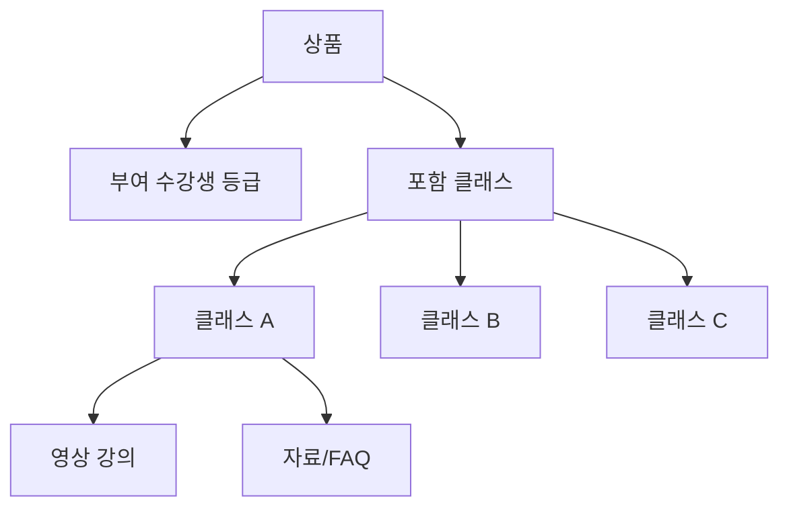
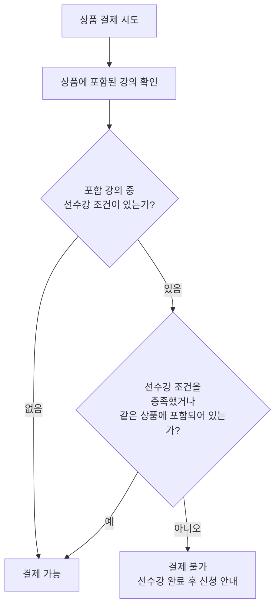
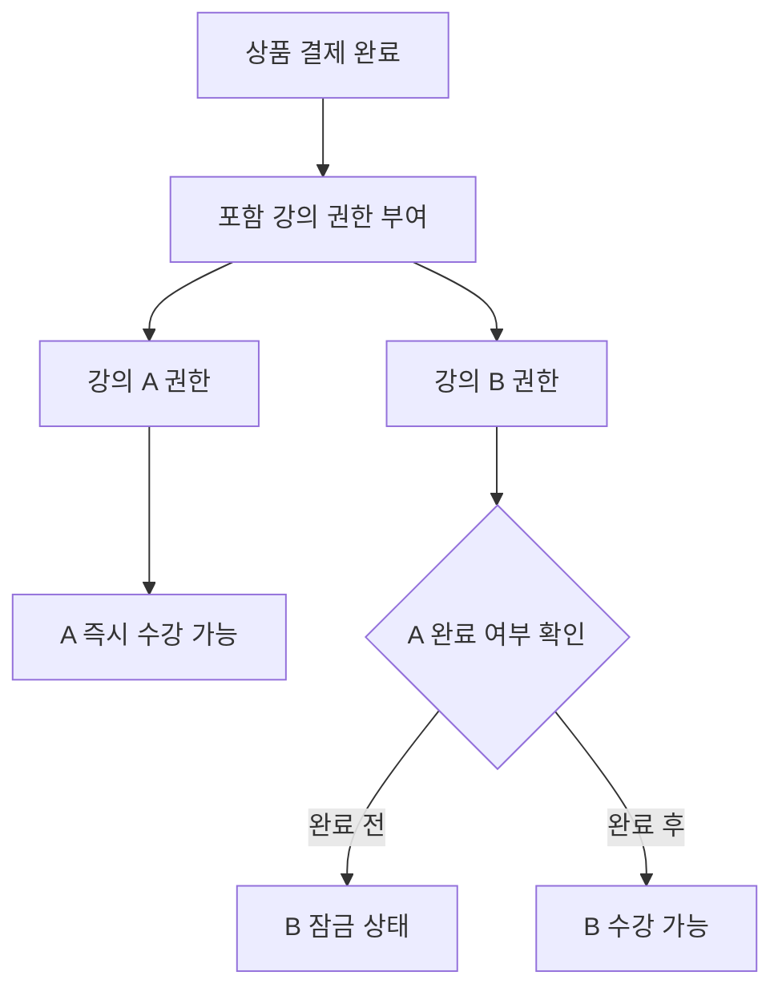

# 크리에이터 상품 구조 변경 로직

기준: 클래스는 학습 콘텐츠 단위이고, 상품은 사용자가 결제하는 대상이다. 결제 완료 후 상품에 설정된 수강생 등급과 포함 클래스별 수강 권한을 생성한다.

## 1. 핵심 개념

### 클래스

- 영상, 자료, FAQ, 운영 안내, 라이브 일정의 묶음이다.
- 단독으로도 판매될 수 있지만, 결제 대상 자체는 상품이다.
- 클래스 안에는 여러 개의 강의 영상이 들어갈 수 있다.
- 선수강 조건은 클래스에 설정한다.
- 수강 가능 여부는 권한 보유 여부와 선수강 조건 충족 여부를 함께 본다.

### 상품

- 사용자가 실제로 결제하는 단위다.
- 상품 유형은 따로 나누지 않는다.
- 하나의 상품은 하나 이상의 클래스를 자유롭게 포함할 수 있다.
- 상품에는 가격, 판매 상태, 판매 기간, 이용 기간 정책, 환불 정책, 결제 후 부여할 수강생 등급이 있다.
- 사용자가 상품을 구매하면 해당 상품에 설정된 수강생 등급이 자동 부여된다.

### 수강생 등급

- 수강생 등급은 사용자의 열람 등급이다.
- 노하우집이 기본 등급 세트를 제공한다.
- 추천 기본 등급은 `루키`, `챌린저`, `프로`, `마스터`, `레전드`다.
- 크리에이터는 상품을 만들 때 “이 상품 구매 시 어떤 등급을 부여할지”를 선택한다.
- 크리에이터가 등급명과 등급 개수를 완전히 커스텀하는 기능은 후속 단계로 둔다.
- 운영자가 수강생의 등급을 예외적으로 수동 변경하는 기능도 후속 단계로 둔다.

### 선수강 조건 설정 위치

- 선수강 과목은 상품이 아니라 클래스에 설정한다.
- 화면 위치는 `크리에이터 관리자 > 클래스 관리 > 클래스 생성/수정 > 2. 수강 조건·일정`이다.
- 해당 영역에서 완료해야 하는 선수강 클래스와 수료 기준을 선택한다.
- 상품 관리의 `포함 클래스` 영역에서는 어떤 클래스 권한을 줄지만 선택한다.
- 그래서 같은 상품에 A와 B가 함께 포함되어도, B에 `A 완료 필요`가 설정되어 있으면 B는 A 완료 전까지 잠금 상태로 노출된다.

### 수강 권한

- 결제 완료된 주문을 기준으로 생성한다.
- 상품에 포함된 클래스마다 1개씩 권한을 만든다.
- 같은 클래스에 대해 여러 상품 권한이 있을 수 있다.
- 유효한 권한이 하나라도 있으면 해당 클래스를 볼 수 있다.

## 2. 데이터 모델 예시

```js
const courses = [
  {
    id: "mmoh-basic",
    creatorId: "mmoh",
    title: "경매 낙찰 기초반",
    accessRule: {
      prerequisiteCourseIds: [],
      completionRequiredPercent: 0
    },
    studyPeriod: {
      startsAt: "2026-07-05",
      endsAt: "2026-08-02"
    },
    contents: {
      videos: [],
      files: [],
      faq: [],
      liveSessions: []
    }
  },
  {
    id: "mmoh-right",
    creatorId: "mmoh",
    title: "권리분석 실전반",
    accessRule: {
      prerequisiteCourseIds: ["mmoh-basic"],
      completionRequiredPercent: 100
    },
    studyPeriod: {
      startsAt: "2026-07-12",
      endsAt: "2026-08-09"
    },
    contents: {
      videos: [],
      files: [],
      faq: [],
      liveSessions: []
    }
  }
];

const products = [
  {
    id: "prd-mmoh-basic-pass",
    creatorId: "mmoh",
    name: "경매 낙찰 기초반 단품",
    price: 290000,
    status: "on_sale",
    includedCourseIds: ["mmoh-basic"],
    grantedMembershipGrade: "챌린저",
    accessPeriod: {
      type: "course_period",
      days: null
    },
    refundPolicyId: "standard-class-refund"
  },
  {
    id: "prd-mmoh-auction-package",
    creatorId: "mmoh",
    name: "경매 실전 패키지",
    price: 590000,
    status: "on_sale",
    includedCourseIds: ["mmoh-basic", "mmoh-right"],
    grantedMembershipGrade: "프로",
    accessPeriod: {
      type: "course_period",
      days: null
    },
    refundPolicyId: "standard-bundle-refund"
  },
  {
    id: "prd-mmoh-middle-pass",
    creatorId: "mmoh",
    name: "경매 기초·권리분석 이용권",
    price: 390000,
    status: "on_sale",
    includedCourseIds: ["mmoh-basic", "mmoh-right"],
    grantedMembershipGrade: "프로",
    accessPeriod: {
      type: "from_payment_date",
      days: 120
    },
    refundPolicyId: "standard-membership-refund"
  }
];

const orders = [
  {
    id: "ord-001",
    userId: "user-001",
    productId: "prd-mmoh-middle-pass",
    amount: 390000,
    paymentStatus: "paid",
    refundStatus: "none",
    paidAt: "2026-07-01T10:00:00+09:00"
  }
];

const entitlements = [
  {
    id: "ent-001",
    userId: "user-001",
    orderId: "ord-001",
    productId: "prd-mmoh-middle-pass",
    courseId: "mmoh-basic",
    status: "active",
    startsAt: "2026-07-01T10:00:00+09:00",
    endsAt: "2026-10-29T23:59:59+09:00"
  },
  {
    id: "ent-002",
    userId: "user-001",
    orderId: "ord-001",
    productId: "prd-mmoh-middle-pass",
    courseId: "mmoh-right",
    status: "active",
    startsAt: "2026-07-01T10:00:00+09:00",
    endsAt: "2026-10-29T23:59:59+09:00"
  }
];

const membershipAssignments = [
  {
    id: "mem-001",
    userId: "user-001",
    orderId: "ord-001",
    productId: "prd-mmoh-middle-pass",
    creatorId: "mmoh",
    grade: "프로",
    status: "active",
    assignedAt: "2026-07-01T10:00:00+09:00",
    endsAt: "2026-10-29T23:59:59+09:00"
  }
];
```

## 3. 상품과 수강생 등급 구성

상품 유형을 나누지 않는다. 상품은 포함 클래스와 부여 등급을 가진 결제 대상이다.



예시:

| 상품명 예시 | 포함 클래스 | 부여 등급 | 결제 후 생성되는 권한 |
| --- | --- | --- | --- |
| 경매 기초 클래스 이용권 | 클래스 A | 챌린저 | 챌린저 등급, 클래스 A 권한 |
| 경매 기초·권리분석 이용권 | 클래스 A, 클래스 B | 프로 | 프로 등급, 클래스 A 권한, 클래스 B 권한 |
| 경매 실전 패키지 | 클래스 A, 클래스 B, 클래스 C | 마스터 | 마스터 등급, 클래스 A/B/C 권한 |
 
중요한 점은 상품을 어떤 이름으로 팔든 결제 완료 후에는 “수강생 등급 + 포함 클래스별 권한”으로 풀어서 저장한다는 것이다. 그래서 내 학습은 상품 카드가 아니라 클래스 카드 기준으로 보여준다.

## 4. 구매 가능 여부

상품 상세 또는 결제 버튼을 보여줄 때 아래 조건을 확인한다.

```js
function canPurchaseProduct({ product, now }) {
  if (!product) return { ok: false, reason: "상품을 찾을 수 없습니다." };
  if (product.status !== "on_sale") return { ok: false, reason: "현재 판매 중인 상품이 아닙니다." };

  if (product.saleStartsAt && now < new Date(product.saleStartsAt)) {
    return { ok: false, reason: "아직 판매 시작 전입니다." };
  }

  if (product.saleEndsAt && now > new Date(product.saleEndsAt)) {
    return { ok: false, reason: "판매 기간이 종료되었습니다." };
  }

  if (!product.includedCourseIds || product.includedCourseIds.length === 0) {
    return { ok: false, reason: "포함된 강의가 없습니다." };
  }

  return { ok: true, reason: "" };
}
```

### 4.1 선수강 조건이 있는 상품의 구매 가능 여부

상품에 포함된 강의 중 선수강 조건이 있는 강의가 있으면, 결제 가능 여부는 아래처럼 판단한다.



정책은 두 가지 중 하나를 선택할 수 있다.

1. 같은 상품 안에 선수강 강의가 함께 포함되어 있으면 결제 허용
2. 선수강 강의를 이미 완료한 사용자만 결제 허용

현재 추천안은 1번이다. 예를 들어 경매 기초·권리분석 이용권에 `강의 A + 강의 B`가 포함되어 있고, B의 선수강 조건이 A라면 결제는 허용한다. 결제 후 A와 B 권한을 모두 부여하되, B는 A 완료 전까지 내 학습에서 잠금 상태로 둔다.

```js
function canPurchaseProductWithPrerequisite({ product, userId }) {
  const included = new Set(product.includedCourseIds);

  for (const courseId of product.includedCourseIds) {
    const course = getCourse(courseId);
    const requiredIds = course.accessRule?.prerequisiteCourseIds || [];

    for (const requiredCourseId of requiredIds) {
      const prerequisiteIsIncluded = included.has(requiredCourseId);
      const prerequisiteIsCompleted = isCourseCompleted({ userId, courseId: requiredCourseId });

      if (!prerequisiteIsIncluded && !prerequisiteIsCompleted) {
        return {
          ok: false,
          reason: `${getCourse(requiredCourseId).title} 완료 후 신청할 수 있습니다.`
        };
      }
    }
  }

  return { ok: true, reason: "" };
}
```

## 5. 결제 완료 후 권한 생성

실서비스에서는 PG 결과를 서버에서 재검증한 뒤 주문을 `paid`로 확정하고 권한을 생성한다.

```js
function completePayment({ order, product, paidAt }) {
  if (order.paymentStatus !== "paid") {
    throw new Error("결제 완료 주문만 권한을 생성할 수 있습니다.");
  }

  return product.includedCourseIds.map((courseId) => {
    const period = resolveEntitlementPeriod({ product, courseId, paidAt });

    return {
      id: createId("ent"),
      userId: order.userId,
      orderId: order.id,
      productId: product.id,
      courseId,
      status: "active",
      startsAt: period.startsAt,
      endsAt: period.endsAt
    };
  });
}

function resolveEntitlementPeriod({ product, courseId, paidAt }) {
  if (product.accessPeriod.type === "from_payment_date") {
    return {
      startsAt: paidAt,
      endsAt: addDaysEndOfDay(paidAt, product.accessPeriod.days)
    };
  }

  if (product.accessPeriod.type === "course_period") {
    const course = getCourse(courseId);
    return {
      startsAt: course.studyPeriod.startsAt,
      endsAt: course.studyPeriod.endsAt
    };
  }

  if (product.accessPeriod.type === "unlimited") {
    return {
      startsAt: paidAt,
      endsAt: null
    };
  }

  throw new Error("지원하지 않는 이용 기간 정책입니다.");
}
```

## 6. 강의 접근 가능 여부

내 학습과 콘텐츠 다운로드/재생 버튼은 이 판단을 사용한다.



```js
function canAccessCourse({ userId, courseId, now }) {
  const activeEntitlement = findActiveEntitlement({ userId, courseId, now });

  if (!activeEntitlement) {
    return {
      ok: false,
      state: "locked",
      reason: "이 강의를 이용할 수 있는 수강 권한이 없습니다."
    };
  }

  const prerequisite = checkPrerequisite({ userId, courseId });
  if (!prerequisite.ok) {
    return {
      ok: false,
      state: "prerequisite_locked",
      reason: prerequisite.reason
    };
  }

  return {
    ok: true,
    state: "available",
    reason: ""
  };
}

function findActiveEntitlement({ userId, courseId, now }) {
  return entitlements.find((entitlement) => {
    if (entitlement.userId !== userId) return false;
    if (entitlement.courseId !== courseId) return false;
    if (entitlement.status !== "active") return false;
    if (new Date(entitlement.startsAt) > now) return false;
    if (entitlement.endsAt && new Date(entitlement.endsAt) < now) return false;
    return true;
  });
}

function checkPrerequisite({ userId, courseId }) {
  const course = getCourse(courseId);
  const requiredIds = course.accessRule?.prerequisiteCourseIds || [];

  for (const requiredCourseId of requiredIds) {
    const progress = getCourseProgress({ userId, courseId: requiredCourseId });
    const requiredPercent = course.accessRule.completionRequiredPercent || 100;

    if (progress.completedPercent < requiredPercent) {
      const requiredCourse = getCourse(requiredCourseId);
      return {
        ok: false,
        reason: `${requiredCourse.title}을 먼저 수강 완료해야 합니다.`
      };
    }
  }

  return { ok: true, reason: "" };
}
```

## 7. 내 학습 노출 로직

내 학습은 구매한 상품이 아니라, 권한이 있는 강의를 기준으로 보여준다.

```js
function getMyLearning({ userId, now }) {
  const userEntitlements = entitlements.filter((entitlement) => {
    if (entitlement.userId !== userId) return false;
    if (entitlement.status !== "active") return false;
    if (new Date(entitlement.startsAt) > now) return false;
    return true;
  });

  const courseIds = [...new Set(userEntitlements.map((entitlement) => entitlement.courseId))];

  return courseIds.map((courseId) => {
    const access = canAccessCourse({ userId, courseId, now });
    const course = getCourse(courseId);
    const creator = getCreator(course.creatorId);

    return {
      course,
      creator,
      accessState: access.state,
      accessReason: access.reason,
      isEnded: isCourseEndedForUser({ userId, courseId, now }),
      progress: getCourseProgress({ userId, courseId })
    };
  });
}
```

## 8. 마이 > 결제 내역 노출 로직

결제 내역은 `마이` 화면에서 주문 기준으로 보여준다. 어떤 수강생 등급과 클래스 권한이 생겼는지는 상품의 부여 등급과 포함 클래스 목록으로 표시한다.

```js
function getPaymentHistory({ userId }) {
  return orders
    .filter((order) => order.userId === userId)
    .sort((a, b) => new Date(b.paidAt) - new Date(a.paidAt))
    .map((order) => {
      const product = getProduct(order.productId);
      const includedCourses = product.includedCourseIds.map(getCourse);

      return {
        orderId: order.id,
        paidAt: order.paidAt,
        productName: product.name,
        grantedGrade: product.grantedMembershipGrade,
        amount: order.amount,
        paymentStatus: order.paymentStatus,
        refundStatus: order.refundStatus,
        includedCourses
      };
    });
}
```

## 9. 환불/취소 시 권한 처리

환불은 주문 상태와 권한 상태를 함께 바꾼다.

```js
function applyRefund({ orderId, refundStatus, revokeAccess }) {
  const order = getOrder(orderId);
  order.refundStatus = refundStatus;

  if (refundStatus === "refunded") {
    order.paymentStatus = "cancelled";
  }

  if (revokeAccess) {
    entitlements
      .filter((entitlement) => entitlement.orderId === orderId)
      .forEach((entitlement) => {
        entitlement.status = "revoked";
        entitlement.revokedAt = new Date().toISOString();
      });
  }
}
```

권장 정책:

- 결제 실패: 주문 생성 가능, 권한 생성 안 함
- 결제 완료: 권한 생성
- 환불 요청: 권한은 정책에 따라 유지 또는 임시 제한
- 환불 완료: 권한 회수 또는 종료일 조정
- 부분 환불: 상품 단위 정책이 필요하므로 MVP에서는 운영자 확인 상태로 둔다

## 10. 관리자 상품 생성 검증

크리에이터 관리자에서 상품 저장 전 아래 조건을 검증한다.

상품 수정 시에는 결제 이력 여부를 먼저 확인한다.

- 결제 이력이 없는 상품: 상품 정보, 포함 클래스, 부여 등급, 가격·이용 기간, 환불·공개 정책을 수정할 수 있다.
- 결제 이력이 있는 상품: `1. 상품 정보`만 수정할 수 있다.
- 결제 이력이 있는 상품에서 수정 가능한 항목은 상품명, 상품 소개, 노출 상태다.
- 결제 이력이 있는 상품의 포함 클래스, 부여 등급, 가격, 이용 기간, 환불 정책을 바꾸려면 기존 상품을 수정하지 않고 새 상품을 생성한다.

```js
function validateProductForm(product) {
  const errors = [];

  if (!product.name?.trim()) errors.push("상품명을 입력해 주세요.");
  if (!product.includedCourseIds?.length) errors.push("포함 클래스를 1개 이상 선택해 주세요.");
  if (!product.grantedMembershipGrade) errors.push("결제 후 부여할 멤버십 등급을 선택해 주세요.");
  if (product.price < 0) errors.push("가격은 0원 이상이어야 합니다.");

  if (product.accessPeriod.type === "from_payment_date" && !product.accessPeriod.days) {
    errors.push("결제일 기준 이용 기간을 입력해 주세요.");
  }

  return {
    ok: errors.length === 0,
    errors
  };
}
```

## 11. 화면 반영 기준

### 크리에이터 공개 페이지

- 상품 유형 탭은 두지 않는다.
- 상품 카드는 상품명, 가격, 포함 클래스, 부여 등급, 이용 기간, 판매 상태를 표시한다.
- 포함 클래스가 1개인 상품과 여러 개인 상품은 같은 카드 규칙으로 노출한다.

### 결제 팝업

- 결제 대상은 상품이다.
- 결제 완료 문구는 “수강생 등급과 포함 클래스 권한이 부여되었습니다”로 표시한다.
- 부여 등급과 포함 클래스 목록을 결제 요약에 보여준다.

### 내 학습

- 상품 목록이 아니라 강의 권한 목록을 보여준다.
- 같은 강의를 여러 상품으로 샀어도 강의 카드는 1개만 보여준다.
- 만료된 권한만 있으면 `수강 종료`로 분류한다.
- 유효 권한은 있지만 선수강 조건 미충족이면 잠금 상태로 보여준다.

## 12. 현재 화면 코드에서 바꿀 지점

현재 정적 화면 코드는 `state.purchased`에 강의 id를 직접 넣는다. 실제 개발에서는 아래처럼 바꾸는 것이 맞다.

```js
state.orders = [];
state.entitlements = [];
```

구매 완료 시:

```js
function confirmPay(productId) {
  const product = productMap[productId];
  const order = createPaidOrder({ product, user: state.user });
  const newEntitlements = completePayment({
    order,
    product,
    paidAt: new Date().toISOString()
  });

  state.orders.push(order);
  state.entitlements.push(...newEntitlements);
}
```

내 학습 렌더링 시:

```js
const learningItems = getMyLearning({
  userId: state.user.id,
  now: new Date()
});
```

이렇게 바꾸면 개별 강의, 패키지, 멤버십이 모두 같은 권한 로직으로 처리된다.
